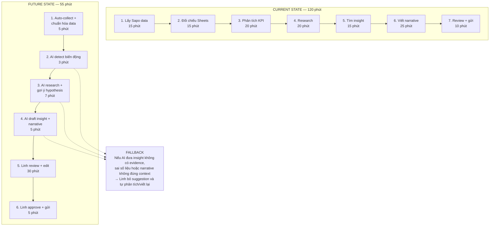
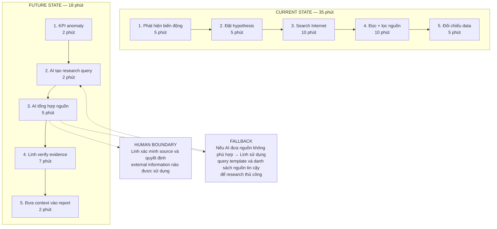
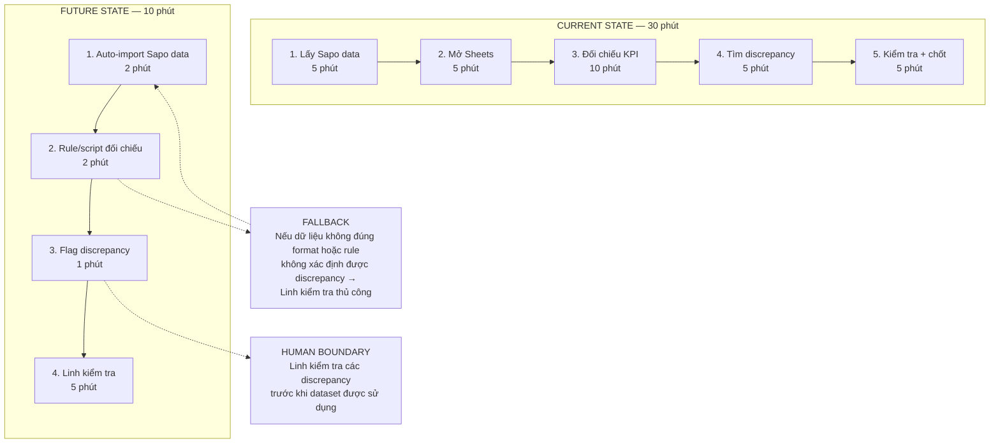

# 01 — Individual Problem Scan

> Điền theo Phase 1 + Phase 2 trong `01-worksheet.md`. Tự scan trước, dùng AI sau để phản biện. Không copy ví dụ Weekly Report.

## Thông tin cá nhân

- Họ và tên: Hà Thị Mỹ Linh
- Mã học viên: 2A202602619
- Vai trò / bối cảnh (VD: sinh viên năm X, intern PM, ...): Data Analyst tại một công ty startup khoảng 20 người.
- Công việc hằng tuần (3-5 gạch đầu dòng để soi problem):
    - Tổng hợp dữ liệu bán hàng từ Sapo để theo dõi doanh thu, đơn hàn và hiệu quả kinh doanh
    - Cập nhật và đối chiếu các KPI trong Google Sheets với dữ liệu từ các nguồn khác.
    - Tìm kiếm thông tin đối thủ và các thị trường mặt hàng tiềm năng trên Internet  hoặc các yếu tố biến động dữ liệu và doanh thu.
    - Phân tích dữ liệu đã thu thập, từ đó tìm ra insight và xác định các điểm bất thường cần chú ý.
    - Viết báo cáo hàng tuần và trình bày các điểm chính nổi bật tạo ra thay đổi cho Manager và CEO.
---

## Phase 1 — Scan 5+ problems (tối thiểu 5, khuyến khích 8-10)

**Cách điền:** mỗi dòng = việc gì + ai chịu + đo bằng gì. Cột `Dấu hiệu thật` bắt buộc có số: mất bao lâu (bấm giờ mấy lần), mấy lần/tuần, bao nhiêu người gặp, log/ticket/quote nào.

| # | Lăng kính (Lặp lại / Tốn thời gian / AI có thể tốt hơn / Pain từ người khác) | Problem quan sát được | Ai chịu ảnh hưởng? | Dấu hiệu thật (số + bằng chứng) |
|---|---|---|---|---|
| 1 |Lặp lại |Mỗi tuần phải tổng hợp dữ liệu từ Sapo và Google Sheets để chuẩn bị cho báo cáo hàng tuần | Linh - Data Analyst |Thực hiện 5 lần/ 1 tuần, mất khoảng 30 phút/ lần. Có thể kiểm tra bằng cách bấm giờ trong 2-3 tuần liên tiếp |
| 2 | Tốn thời gian |Phải kiểm tra và đối chiếu số liệu giữa Sapo và Google Sheets trước khi đưa vào báo cáo. |Linh |Mỗi tuần 10 chỉ số cần đối chiếu, mất 5 giờ/tuần|
| 3 |Tốn thời gian |Tìm kiếm thông tin trên Internet để giải thích nguyên nhân của các biến động về doanh thu, đơn hàng hoặc sản phẩm | Linh | Thực hiện khoảng 5 lần/tuần, mỗi lần mất 90 phút; thường phải mở 5 nguồn để đối chiếu |
| 4 |AI có thể làm tốt hơn |Sau khi có số liệu, Linh phải tự xác định KPI nào tăng/giảm đáng chú ý và tìm ra cấc pattern cần phân tích | Linh; Manager/CEO | 5 KPI cần review mỗi tuần; bước phân tích ban đầu mất 60 phút |
| 5 |Tốn thời gian |Từ kết quả phân tích phải tự xây dựng dashboard dễ hiểu cho Manager và CEO | Linh; Manager/CEO | Mỗi báo cáo tuần mất 90 phút để viết insight và làm dashboard |
| 6 |Pain từ người khác |Manager/CEO có thể hỏi lại "Tại sao chỉ số này lại tăng/ giảm?" khi báo cáo mới chỉ nêu số liệu, các biểu đồ mà chưa giải thích nguyên nhân |Manager/CEO, Linh |Trong 1 tuần gần nhất có ít nhất 1 lần phải bổ sung hoặc giải thích lại insight sau khi gửi báo cáo|
| 7 |Tốn thời gian |Sau khi phân tích xong phải định dạng lại dữ liệu, bảng và nội dung trước khi gửi báo cáo hàng tuần | Linh |Mỗi báo cáo mất 90 phút cho định dạng/ xem lại; thực hiện 1 lần/tuần |
| 8 | | | | |
| 9 | | | | |
| 10 | | | | |

> Gợi ý tự soi: tuần trước mất nhiều thời gian nhất vào việc gì? Việc gì hay trì hoãn? Người khác hay hỏi lại câu gì? Workflow nào ai cũng biết là chậm?

**AI đã dùng ở Phase 1 (nếu có):**
- Prompt đã hỏi:Tôi là Data Analyst tại một startup khoảng 20 người. Hàng tuần tôi phải lấy dữ liệu từ Sapo, Google Sheets và tìm kiếm thông tin trên Internet để phân tích, tìm insight và viết Weekly Report cho Manager và CEO. Hãy giúp tôi brainstorm 10 problems có thể xảy ra trong workflow này. Với mỗi problem, hãy xác định actor, bước workflow liên quan, dấu hiệu có thể đo được và khả năng dùng AI. Không mặc định rằng solution phải là AI.
- Ý dùng được:
    - Tách problem thành các bước: data collection → checking → analysis → research → insight → writing.
    - Phân biệt pain do lặp lại/tốn thời gian với pain có khả năng dùng AI.
    - Chú ý đến bước giải thích biến động và chuyển số liệu thành phần diễn giải.
    - Xem xét cả pain của Manager/CEO, không chỉ pain của Data Analyst.
- Ý bỏ vì không phải pain thật:
    -  có thể tự động hóa toàn bộ công việc Data Analyst.”
    - “AI có thể thay Data Analyst viết toàn bộ report.”
    - Các vấn đề chưa có actor, workflow hoặc cách đo cụ thể.
**Self-check Phase 1:**
- [ ] Đủ 5+ dòng, mỗi dòng có actor + số đo cụ thể
- [ ] Dùng ít nhất 3/4 lăng kính
- [ ] Không có dòng chung chung kiểu "mất nhiều thời gian"

---

## Phase 2 — Top 3 Problem Cards

### 2.1. Chọn top 3

Giữ bài nào: actor cụ thể, workflow vẽ được 3-7 bước, bottleneck ở 1 bước, impact đo được. Loại bài quá rộng.

| Rank | Problem (copy từ bảng scan) | Vì sao chọn (2-3 ý) | Điều còn chưa chắc |
|---|---|---|---|
| 1 |Từ dữ liệu tổng hợp → tìm insight và viết Weekly Report |Workflow rõ; diễn ra hàng tuần; có thể đo thời gian; AI có khả năng hỗ trợ phân tích và draft narrative; impact trực tiếp đến Manager/CEO. |Cần đo chính xác bao nhiêu phút dành cho analysis + writing và tỷ lệ insight AI tạo ra được sử dụng. |
| 2 |Research Internet để giải thích biến động dữ liệu |Có workflow lặp lại; mất thời gian tìm và đối chiếu nhiều nguồn; AI có thể hỗ trợ research và tổng hợp chứng cứ.|Cần xác định research thực sự mất bao nhiêu thời gian và bao nhiêu % research tạo ra insight hữu ích.|
| 3 |Đối chiếu dữ liệu Sapo và Google Sheets|Có nguồn dữ liệu cố định; workflow tương đối tuyến tính; có thể tự động hóa bằng Rule/Workflow; dễ đo thời gian tiết kiệm. |Cần xác định số lượng khác biệt thực tế và xem việc tự động có đủ ổn định không. |

### 2.2. Problem Cards chi tiết (lặp lại cho cả 3 cards)

---

#### Problem Card #1 — Phân tích dữ liệu và viết insight cho Weekyly Report

```text
Problem 1 câu:
Mỗi tuần Linh mất khoảng 120 phút để tổng hợp, phân tích dữ liệu từ Sapo và Google Sheets, research thông tin bên ngoài, tìm insight và viết Weekly Report cho Manager và CEO; trong đó khoảng 60 phút tập trung vào analysis, research và writing.

Actor:
Hà Thị Mỹ Linh – Data Analyst tại startup khoảng 20 người.

Thời điểm / bối cảnh:
Mỗi tuần, trước khi gửi Weekly Report cho Manager và CEO.

Current workflow:

Lấy dữ liệu từ Sapo — 15 phút
Đối chiếu và tổng hợp KPI trên Google Sheets — 15 phút
Phân tích các KPI tăng/giảm — 20 phút
Research Internet để tìm context/nguyên nhân — 20 phút
Xác định insight và recommendation — 15 phút
Viết narrative cho Weekly Report — 25 phút
Review, format và gửi report — 10 phút

Tổng: 120 phút/tuần

Bottleneck:
Bước 3-6, đặc biệt là research → tìm insight → viết narrative, chiếm khoảng 80 phút nếu tính cả analysis, research và writing. Đây là phần khó chuẩn hóa hoàn toàn bằng rule vì mỗi tuần có thể xuất hiện những biến động khác nhau.

Impact:

Linh mất khoảng 2 giờ/tuần cho một Weekly Report.
Tương đương khoảng 8 giờ/tháng nếu duy trì 4 tuần.
Khoảng 60 phút/tuần dành cho analysis, research và writing.
Manager/CEO có thể phải hỏi thêm khi insight chưa giải thích rõ nguyên nhân hoặc impact.

Success metric:

Giảm thời gian hoàn thành Weekly Report từ 120 phút xuống ≤60 phút/tuần.
Giảm riêng thời gian analysis + research + writing từ 60 phút xuống ≤25 phút.
Không làm tăng số lần Manager/CEO yêu cầu bổ sung hoặc sửa insight.

Non-AI alternative:
Chuẩn hóa template Weekly Report, xây dashboard KPI cố định, thiết lập threshold để flag KPI tăng/giảm bất thường và tạo danh sách nguồn Internet thường xuyên sử dụng.

AI hypothesis:
AI nhận dataset đã được chuẩn hóa, tự động xác định các biến động đáng chú ý, gợi ý hypothesis, hỗ trợ research context và draft phần insight/narrative. Linh vẫn kiểm tra số liệu, nguồn và approve nội dung cuối cùng.

Quick gut:
[ ] No AI / process fix
[ ] Rule
[x] Workflow
[ ] Agent
[ ] Chưa biết
```

**Draft workflow Card #1** (ASCII / Mermaid / ảnh đính kèm):



---

#### Problem Card #2 — Research Internet để giải thích biến động dữ liệu

```text
Problem 1 câu:
Mỗi tuần Linh mất khoảng 35 phút để research Internet nhằm tìm context và nguyên nhân giải thích cho các biến động trong dữ liệu kinh doanh.

Actor:
Hà Thị Mỹ Linh – Data Analyst.

Thời điểm / bối cảnh:
Sau khi kiểm tra Weekly KPI và phát hiện những chỉ số tăng/giảm đáng chú ý.

Current workflow:

Phát hiện KPI bất thường — 5 phút
Đặt hypothesis về nguyên nhân — 5 phút
Search Internet — 10 phút
Đọc và lọc các nguồn — 10 phút
Đối chiếu với dữ liệu nội bộ — 5 phút

Bottleneck:
Bước 3-4: tìm kiếm và đọc nhiều nguồn để xác định thông tin nào thực sự liên quan.

Impact:

Khoảng 35 phút/tuần cho research.
Trung bình 3-5 vấn đề/tuần cần tìm thêm context.
Mỗi vấn đề mất khoảng 7-10 phút.
Có nguy cơ sử dụng nguồn không đủ uy tín hoặc thông tin không thực sự giải thích được biến động.

Success metric:

Giảm thời gian research từ 35 phút xuống ≤15 phút/tuần.
100% external claim được đưa vào report phải có nguồn kiểm chứng.
Linh vẫn xác nhận evidence trước khi đưa vào report.

Non-AI alternative:
Tạo danh sách nguồn tin cậy, query template theo từng nhóm KPI và checklist đánh giá nguồn.

AI hypothesis:
AI hỗ trợ tạo research query, tìm và tổng hợp context từ các nguồn liên quan, sau đó đưa evidence/source cho Linh kiểm tra.

Quick gut:

[ ] No AI / process fix

[ ] Rule

[x] Workflow

[ ] Agent

[ ] Chưa biết
```

**Draft workflow Card #2:**




---

#### Problem Card #3 — Đối chiếu dữ liệu Sapo và Google Sheets

```text
Problem 1 câu:
Mỗi tuần Linh mất khoảng 30 phút để kiểm tra và đối chiếu dữ liệu giữa Sapo và Google Sheets trước khi sử dụng cho Weekly Report.

Actor:
Hà Thị Mỹ Linh – Data Analyst.

Thời điểm / bối cảnh:
Trước khi bắt đầu phân tích Weekly KPI.

Current workflow:

Export/lấy dữ liệu từ Sapo — 5 phút
Mở Google Sheets và xác định các KPI tương ứng — 5 phút
Đối chiếu số liệu — 10 phút
Tìm discrepancy — 5 phút
Kiểm tra nguyên nhân và chốt dataset — 5 phút

Bottleneck:
Bước 3-4: đối chiếu thủ công và tìm discrepancy giữa hai nguồn.

Impact:

Khoảng 30 phút/tuần.
Khoảng 2 giờ/tháng chỉ dành cho reconciliation.
Nếu discrepancy không được phát hiện, các bước analysis và insight phía sau có thể bị ảnh hưởng.

Success metric:

Giảm thời gian reconciliation từ 30 phút xuống ≤10 phút/tuần.
100% discrepancy được flag trước khi dataset được sử dụng để phân tích.
Không tăng số lỗi dữ liệu trong Weekly Report.

Non-AI alternative:
Dùng Google Sheets chuẩn hóa format, formula và conditional formatting để tự động flag discrepancy.

AI hypothesis:
Không cần AI ở bước đầu. Dùng Rule/Script để tự động import và đối chiếu. AI chỉ được cân nhắc khi cần giải thích discrepancy hoặc tìm nguyên nhân.

Quick gut:

[ ] No AI / process fix

[x] Rule

[ ] Workflow

[ ] Agent

[ ] Chưa biết
```

**Draft workflow Card #3:**




---

### 2.3. Card muốn pitch nhất (chuẩn bị 2 phút)

**Card tôi muốn pitch nhất:**

```text
Phân tích dữ liệu → Research → Tìm insight → Draft Weekly Report
```

**Vì sao (2-3 câu: workflow gì, số đo gì, impact gì):**

```text
Đây là workflow diễn ra hàng tuần và ảnh hưởng trực tiếp đến chất lượng
thông tin Manager và CEO sử dụng để theo dõi business. Pain không chỉ nằm
ở việc lấy dữ liệu mà nằm ở bước biến nhiều nguồn dữ liệu thành insight
và narrative có context.

Workflow có thể đo được bằng thời gian hoàn thành report, thời gian dành
cho analysis/research/writing và số lần Manager/CEO yêu cầu giải thích
hoặc sửa lại report. AI có thể hỗ trợ ở các bước detect anomaly,
research, hypothesis generation và draft narrative, trong khi Linh vẫn
giữ quyền kiểm tra và approve output cuối cùng.
```

**Câu hỏi tôi muốn nhóm challenge (1-2 câu hỏi đúng chỗ yếu):**

```text
1. Bottleneck thực sự nằm ở bước analysis/research/writing hay phần
   data collection và reconciliation mới là phần tốn thời gian nhất?

2. Làm thế nào đo được "insight tốt" thay vì chỉ đo AI giúp viết report
   nhanh hơn?
```

**AI phản biện Card (nếu có):**
- Điểm yếu AI chỉ ra:
Problem ban đầu hơi rộng vì gom cả data collection, data cleaning, analysis, research và writing.
“AI tìm insight” là claim dễ quá mức nếu chưa xác định rõ input và tiêu chí đánh giá insight.
Chưa có baseline thời gian thực tế.
“Insight tốt” khó đo nếu chỉ dùng cảm nhận.
Research Internet có rủi ro đưa thông tin không liên quan hoặc nguồn không đáng tin vào report.
- Tôi sửa gì:
Tôi thu hẹp problem vào đoạn:
"Data đã được tổng hợp → phát hiện biến động → research context →
tạo insight → draft narrative."

AI không được tự quyết định insight cuối cùng và không được tự gửi report.

Linh vẫn kiểm tra:
1. Số liệu;
2. Evidence/source;
3. Logic của insight;
4. Narrative cuối cùng.

Tôi cũng bổ sung các metric cần đo thực tế thay vì tự giả định
thời gian tiết kiệm.
### Self-check nộp phần 01
- [x ] Có 5+ problems + top 3 Cards đủ field
- [ x] Mỗi Card có workflow trước/sau + bottleneck + metric + fallback
- [ x] Đã chọn 1 card pitch + câu hỏi challenge
